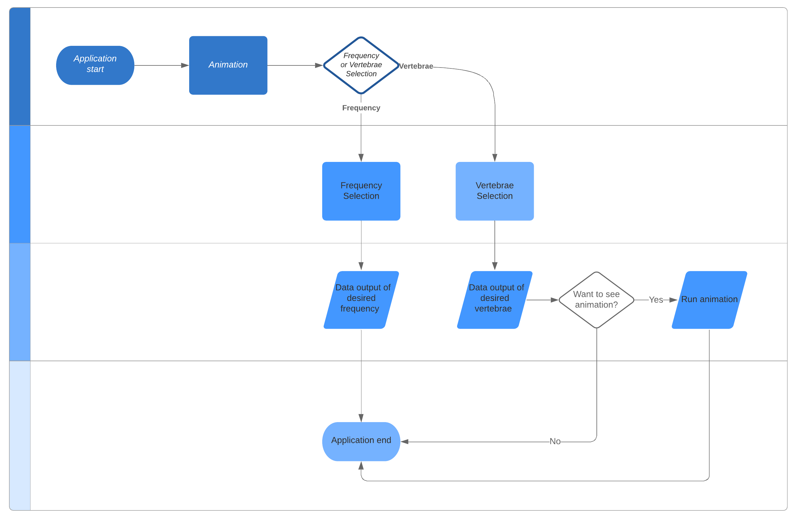
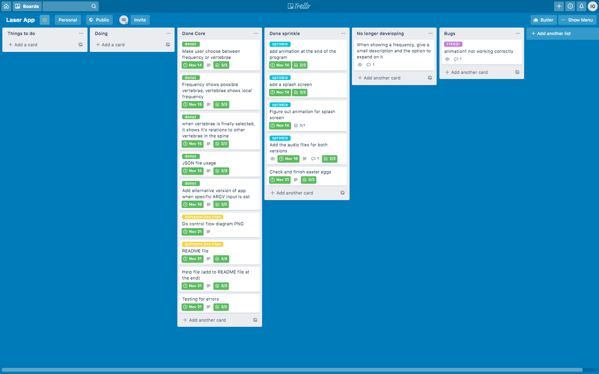

# The Laser Project - Software Development Plan and Help File

[thelaserproject](https://github.com/igscl/thelaserproject)!

## Statement of Purpose and Scope

### What is it for?

This app is developed to support practitioners in training of Sintergetica - an alternative medicine modality - to remember complex data found in charts for the purposes of memory training and safe checking when training for treating patients. The application gives the data requested without having to look at large complex tables, facilitating focus and efficiency, while making learning fun.

The data given by this application is:

- Frequencies and their band and column
- Frequencies and their location in the Central Nervous System
- Location in the spine, vertebrae and related vertebrae

All this data is returned with a simple keyboard navigation, without having to type or search. All the possible variations are collected in nicely coloured menus. The data is presented in 3 simple steps:

- Prompt user for data type: frequency of vertebrae
- Prompt user for desired frequency or desired vertebrae
- Return data of relations and local frequencies
- Option to see animation on how the laser should be used

### The Problem

Every student has had trouble remembering data. Piano students often need their sheet music until they don't need it anymore - while some use theirs forever! What we're trying to do here is provide students with a simple and fun way to remember what they need. We're developing it because we are practitioners! And have dealt with these issues for a long time. Everyone likes learning in fun ways and we aim to keep people motivated with what they do. Sometimes you need to do that in funny ways. (That's why we might have included some Easter eggs... Shhhh, don't tell anyone.)

### Who is it for?

Students in training and current practitioners who just want to safe check - or have fun!

### How will it be used?

When a practitioner finds a certain frequency, it might be useful to double check where that frequency naturally resides. Checking with the app is a way to make sure. Students could also practice without having to look at large tables, like in a card memory game!

## Features

The application includes the following features:

- Frequency or Vertebrae selection: We have two convenient ways to navigate, say goodbye to old dated charts! Press F for frequency or V for vertebrae. And don't worry... if you press anything else, well, you'll know.

- Fast access menus: We have built our app with you in mind! Our focus was to make the access as fast as possible through a fast, intuitive and easy way of navigating through our data. The data is organised the way it should be and just the way you have used it through the years - nothing has changed but everything has changed! Now just select the input with the arrow keys and press enter when you find your desired choice.

- Output of the desired frequency data: First you'll get an octave selection, then the desired frequency. Press ENTER and you'll get the following outputs in an organised way:
		- Band and Column
		- Location and Central Nervous System location
		- Vertebrae relation to other vertebrae

- Output of the desired vertebrae data: You'll directly get the right vertebrae selection. You can use up, down, left and right arrow keys to get into your desired frequency. The selection is in green and indicated with a small green arrow on the left. Press ENTER for the desired frequency and this will give the following output:
		- Vertebrae frequency and location in the Central Nervous System
		- Vertebrae relation to other vertebrae in the spine

- Sound effects: All our app uses fun sound effects! This is for having fun, remember? We kept you in mind with a theme from a galaxy far, far away.

- Animations: When entering the app you'll be able to find some cool animations, and at the very end be able to see an example animation of the laser application when you have selected vertebrae in the navigation menu. Make sure to turn the volume up!

## User Interaction and Experience

The user interaction was made thinking of the user and thinking of students. We know there's an animation in the beginning, but that's only so you can relax, and we can show off.

Our app works as follow:
- Splash animation screen and sound!
- You will be prompted to select either Frequency or Vertebrae selection. The only valid inputs are either F for Frequency or V for Vertebrae, if you try anything else, you'll know. Make sure your volume is up ;)
	- If you selected Frecuency: First, you'll need to choose an octave through the navigational menu (use up, down, left and right arrow keys). Make your selection by pressing ENTER! After doing so make sure to select the frequency in the same manner. After that you'll get the following data:
		
			- Band and Column
			- Location and Central Nervous System location
			- Vertebrae relation to other vertebrae
			- You will exit the program

	- If you selected Vertebrae: Choose vertebrae through the navigational menu (use up, down, left and right arrow keys). Make your selection by pressing ENTER! After that you'll get the following data:

			- Vertebrae frequency and location in the Central Nervous System
			- Vertebrae relation to other vertebrae in the spine
			- Choice to see an animation or not. If yes, you'll see a cool animation, if no is selected, you will exit the program

If at any point during the use of the application you input data that you aren't supposed to, we'll know... and you'll know too!

## Control Flow Diagram

## Implementation Plan

See on [Trello](https://trello.com/b/OpK9nfI3/laser-app)!

## HELP!

What you need to run this app:

### System requirements

Hardware requirements:
- 1.8 GHz or faster processor. Dual-core or better recommended.
- 4 GB of RAM; 8 GB of RAM recommended (4 GB minimum if running on a virtual machine).
- Hard disk required, by default: approx. 5.6GB.

OS and additional requirements:
- macOS High Sierra 10.13
- Command line tools for Mac OS (http://osxdaily.com/2014/02/12/install-command-line-tools-mac-os-x/)
- Ruby 2.6.3p62
- Ruby Gems: curses 1.3, json 2.2, colorize 0.8.1, tty-prompt 0.19.0.
- Homebrew 2.1.16

### How to install

- Go on Terminal and install Command line tools for Mac OS:

		xcode-select --install

- Install Homebrew 2.1.16 and Ruby 2.6.3p62

- Install needed gem files running this script in the project directory:

		bundle install

- On terminal, run the app by using the following command on the project's directory:

		ruby index.rb

### Application Features
This was already included in line 36 of this file if you want to go in depth, but basically this app allows you to:

- Get the frequency data of a selected frequency input by menu navigation
- Get the vertebrae data of a selected vertebrae input by menu navigation
- If a selection of vertebrae was made, see a cool animation
- Navigate using cool sounds
- See a splash screen... check for hidden features!

The data of this application is contained in a JSON file, if the program can't connect to the database you'll get an error.

